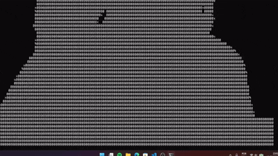
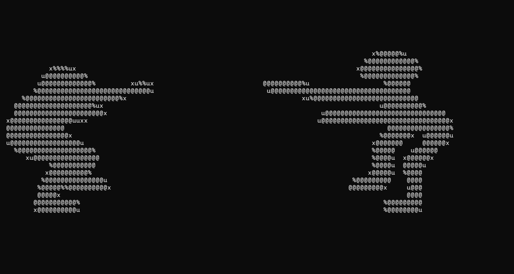
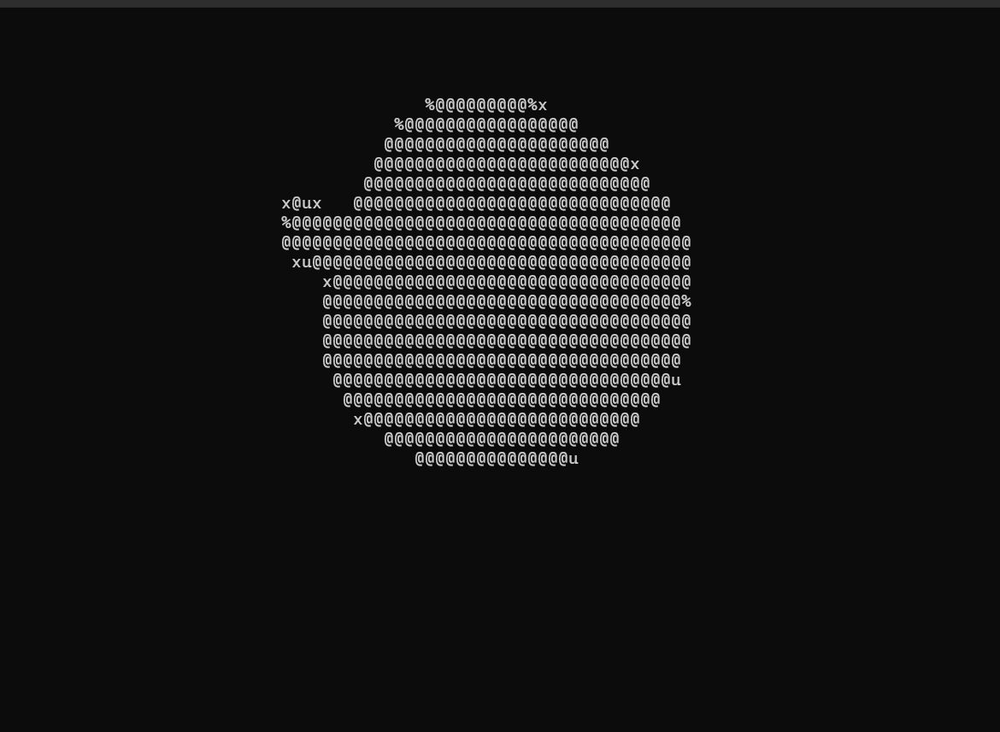

# 🎬 Bad Apple ASCII in CMD (Windows)

<p align="center">
  
</p>

<p align="center">
  <a href="https://www.python.org/downloads/"></a>
  
  
  
</p>

Transforma vídeos em arte ASCII no **CMD do Windows**:
- personagem em “vazio”
- fundo com caracteres como `@ % u x`
- áudio sincronizado

---

## ✨ Demo



<p align="center">
  
  
</p>

---

## 🚀 Quick Start

```powershell
cd "c:\Users\fa285\OneDrive\js aprende"
python -m venv .venv
.\.venv\Scripts\python -m pip install --trusted-host pypi.org --trusted-host files.pythonhosted.org opencv-python numpy pygame imageio-ffmpeg
```

Rodar com menu interativo:

```cmd
run_badapple.cmd
```

Rodar vídeo específico:

```cmd
run_badapple.cmd bad_apple.mp4
```

---

## 🧠 Funcionalidades

- Renderização ASCII em tempo real no `cmd.exe`
- Áudio automático do vídeo (`--audio auto`) com fallback local de `ffmpeg`
- Ajuste de largura automático para janela (`--width 0`)
- Menu interativo no `.cmd`
- Suporte a **arrastar e soltar** vídeo no `run_badapple.cmd`

---

## 🕹️ Uso

### 1) Menu interativo

```cmd
run_badapple.cmd
```

### 2) Arrastar e soltar

- Arraste seu `.mp4` para cima de [`run_badapple.cmd`](run_badapple.cmd).
- O script pega o caminho automaticamente e inicia.

### 3) Comandos úteis

Modo padrão:

```cmd
run_badapple.cmd bad_apple.mp4
```

Mais leve (PC fraco):

```cmd
run_badapple.cmd bad_apple.mp4 --width 90 --fps 20
```

Sem áudio:

```cmd
run_badapple.cmd bad_apple.mp4 --no-audio
```

---

## ⚙️ Flags do Player

Arquivo: [`cmd_badapple.py`](cmd_badapple.py)

- `--video <path>`
- `--audio <path|auto>`
- `--width <cols>` (`0` = auto)
- `--fps <n>`
- `--chars " @%ux"`
- `--invert` / `--no-invert`
- `--no-audio`

---

## 📁 Estrutura do Projeto

```text
.
├─ cmd_badapple.py
├─ run_badapple.cmd
├─ bad_apple.mp4
├─ sink song meme.mp4
├─ sink song proibido.mp4
├─ tun tun tun.mp4
├─ README.md
└─ docs/
   └─ images/
      ├─ demo.gif
      ├─ screenshot-1.png
      └─ screenshot-2.png
```

Arquivos principais:
- [`cmd_badapple.py`](cmd_badapple.py)
- [`run_badapple.cmd`](run_badapple.cmd)
- [`bad_apple.mp4`](bad_apple.mp4)
- [`README.md`](README.md)

---

## 🖼️ Como deixar este README bonito no seu GitHub

1. Grave um GIF curto da execução (10–15s) e salve em `docs/images/demo.gif`.
2. Tire 2 prints da tela e salve como:
   - `docs/images/screenshot-1.png`
   - `docs/images/screenshot-2.png`
3. (Opcional) Depois de subir as imagens reais, troque os links dos placeholders na seção **Demo**.
4. Faça commit e push.

Pronto: o README vai exibir automaticamente o GIF + screenshots.

---

## 🛠️ Troubleshooting

- Se “empilhar” texto no CMD:
  - use `--width 90 --fps 20`
  - evite abrir com largura extrema
- Se áudio não tocar:
  - rode com `--no-audio`
  - ou instale `ffmpeg` global (admin) via Chocolatey
- Se der erro de caminho:
  - arraste o arquivo em cima do `run_badapple.cmd`

---

## 📌 Créditos

Projeto montado para reproduzir o estilo “ASCII no CMD”, com foco em visual invertido e uso fácil no Windows.

- by 2πr
